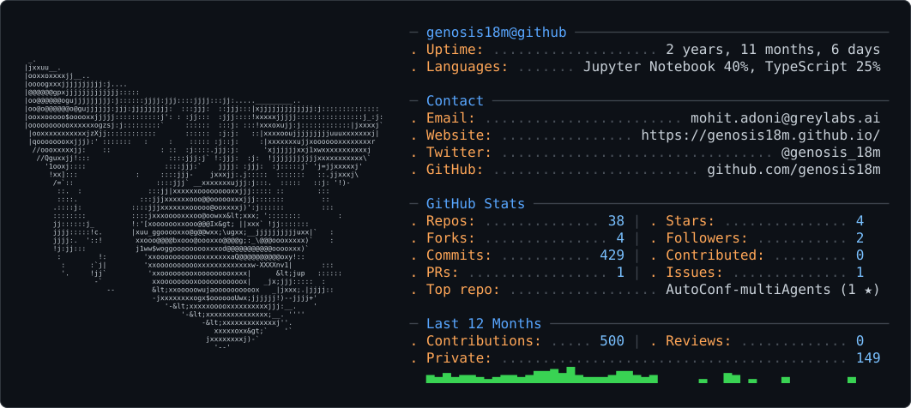

<picture>
  <source media="(prefers-color-scheme: dark)" srcset="dark_mode.svg" />
  <source media="(prefers-color-scheme: light)" srcset="light_mode.svg" />
  
</picture>

  

<h1 align="center">Hi 👋, I'm Mohit Adoni</h1>
<h3 align="center">Full Stack & AI Engineer</h3>

  

  

- 🔭 I'm passionate about building scalable **Full-Stack Applications & AI Systems**
  
- 🌱 I'm currently learning **Generative AI frameworks (PyTorch, TensorFlow, LangChain) and Applied ML**

- 💬 Ask me about **Full-stack development, systems engineering, Go, or your favorite anime** (always down to discuss My Hero Academia!)

- 📫 How to reach me **mohitadoni01@gmail.com**

- 📍 Based at **IIT Roorkee, India**

<h3 align="left">Connect with me:</h3>

